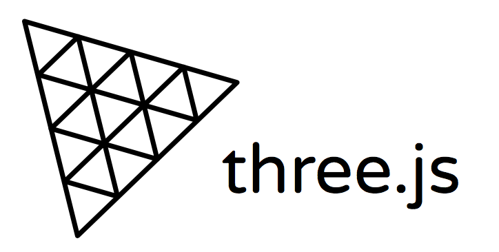
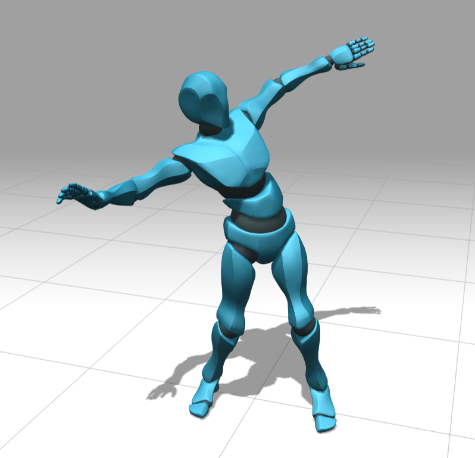

## ThreeJS

Dans ce workshop, nous allons découvrir les bases de **threeJS**.

Tout d'abord, qu'est-ce que **TreeJS**? **ThreeJS** est une interface, légere, d'une librairie 3D avec un rendu WebGL. 

Pour explorer quelques possibilités de **ThreeJS**, nous allons faire un super danceur de samba !

## L'installation
Pour le Workshop, vous aurez juste à télécharger ce repository.

## Les steps

- Dans le but de commencer à créer notre scene, nous avons besoin d'une page HTML basic pour la display.
- Nous allons ensuite setup la scene de threeJS.
    - Creer la scene (le container global).

			new THREE.Scene();
    - Setup la camera (le point de vue).

			new THREE.PerspectiveCamera(fov, aspect, nea, far);
    - Setup le render (outil de display).

			new THREE.WebGLRenderer({ antialias: true });
    - La boucle de Render.

			    requestAnimationFrame(animate);
- Nous allons enuite mettre un sol pour notre danceur, ainsi qu'une grille au sol afin de pouvoir bien le dicerner.

		ground = new THREE.Mesh(new THREE.PlaneBufferGeometry(width , height),
		new THREE.MeshPhongMaterial());
		grid = new THREE.GridHelper(size, divisions , colorCenterLine , colorGrid);
- Nous allons ajouter des sources de lumieres afin de bien voir notre sol et notre future professionel.

		new THREE.DirectionalLight(color);
- Nous allons ensuite loader un object 3D qui représente le danceur et  qui contient le mesh, la texture et les animations.

		Ligne 41 à 53 de danceur.js
- Comme nous avons vu plus haut, l'object 3D contient les animations; il suffit de creer un mixer a partir de l'object , de creer une action sur la premiere frame de l'animation et d'animer à toutes les frames l'object en fonction d'un delta afin de le faire bouger fluidement.

		mixer.update(delta);
- Nous voulons pouvoir se déplacer autour du danceur, donc nous allons ajouter un "Control" de la camera.

		new THREE.OrbitControls(camera);
- Pour rajouter plus de réalisme, nous allons ajouter les ombres de l'objet 3D.

		    light.castShadow = true;

Voila, nous venons de faire rapidement et simplement un setup de scene ainsi qu'une animation d'object 3d avec controle complet de la caméra avec ThreeJS.
